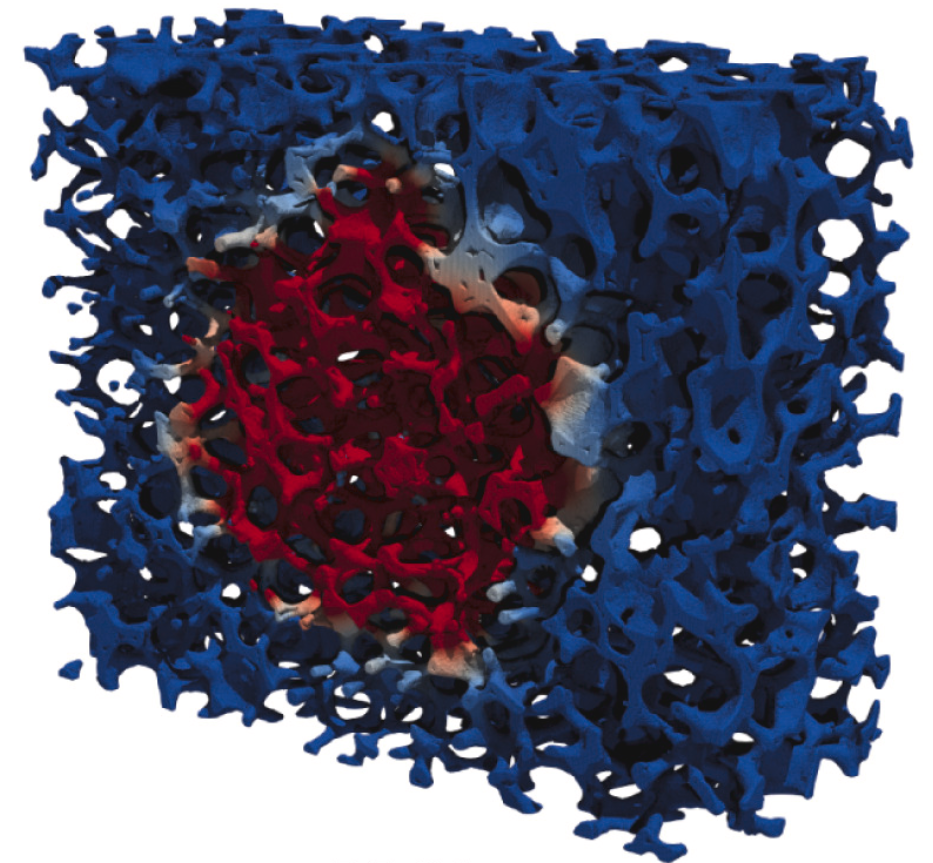
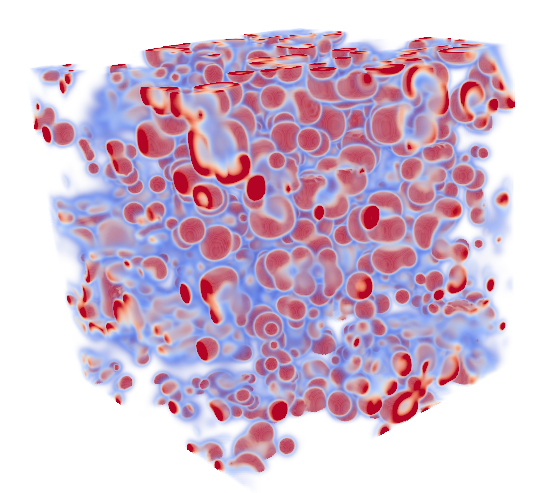
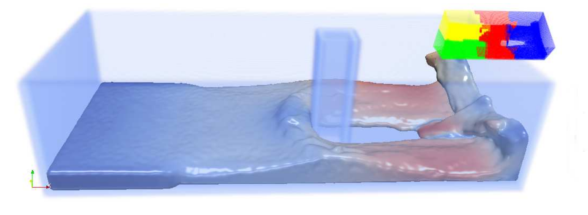
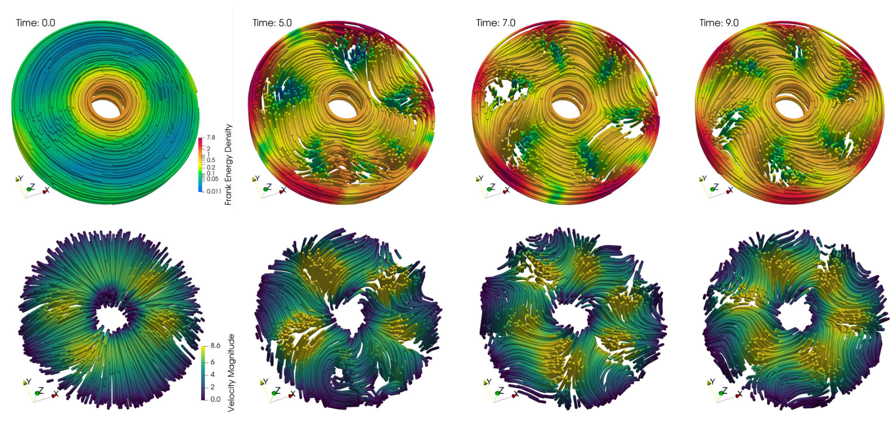
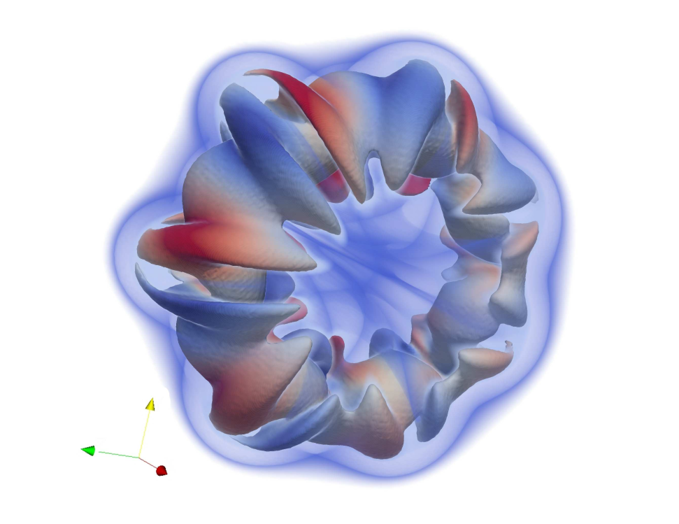

OpenFPM is a scalable open framework for _particle_ and _particle-mesh_ codes on parallel computers.

## Features

* Scalable serial and parallel data structures for heterogeneous computing systems available CPU and GPU-accelerated hardware
* Operators for particle methods linear differential discretization, e.g. DC-PSE, [SPH](vector-example.md)
* Particle-mesh and mesh-particle interpolation schemes
* Data structures for efficient particle methods simulations, e.g. [Cell-List, Verlet-List](vector-example.md#ex2), for efficient item-based, e.g. [Lennard-Jones molecular dynamics](vector-example.md#ex6), and continuous simulations
* Sparse grid on CPU and GPU
* Support for [PETSc](https://petsc.org/), [Eigen](https://eigen.tuxfamily.org/index.php) linear algebra backends
* Support for ODE integration operators with [Boost.Numeric.Odeint](https://www.boost.org/doc/libs/1_82_0/libs/numeric/odeint/doc/html/index.html)
* Level-set formulation with [Algoim](https://algoim.github.io)
* GPU execution backends include [CUDA](https://developer.nvidia.com/cuda-toolkit), [HIP](https://rocm.docs.amd.com/projects/HIP/en/latest/), [OpenMP](https://www.openmp.org/), [alpaka](https://alpaka.readthedocs.io/en/latest/)
* ... and many others

--- 

## Contact

Use the GitHub [issue tracker](https://github.com/mosaic-group/openfpm/issues)
to report bugs/questions/comments. 
See the [Cite us](about.md) page for the citation information.

## Documentation

[Building from source](building.md)
┊ [Using Docker](docker.md)
┊ [Examples](vector-example.md)
┊ [Videos](videos.md)
┊ [Doxygen](https://ppmcore.mpi-cbg.de/doxygen/openfpm/)

##  Selected simulations

OpenFPM is used in many projects, please see some of the simulation samples below. Other examples are available in the [Example section](vector-example.md).

 

*[Diffusive heat conduction](https://www.sciencedirect.com/science/article/pii/S1877750323001783) with distributed surface sink in a sample of reticulate porous ceramics. Reconstruction of the solid phase represented as a sparse-grid level set*

----

*[Visualization](vector-example.md) of the OpenFPM-simulation of one of steady-state patterns produced by the Gray-Scott reaction-system in 3D.*

----

*[Dam-break simulation](https://onlinelibrary.wiley.com/doi/10.1002/cpe.7870) of weakly compressible Navier-Stokes equations in SPH formulation. The figure shows a density iso-surface
indicating the fluid surface with color indicating the fluid velocity magnitude. The simulation domain is split into 4 subdomains run on 4 processors.*

----

*Fully developed bent coherent angular motion of an [active fluid](https://pubs.aip.org/aip/pof/article/35/10/105155/2919100/A-numerical-solver-for-active-hydrodynamics-in) in a 3D annular domain with visualized polarity (top) and velocity (bottom) streamlines.*

----

*OpenFPM [simulation](vector-example.md) of a vortex ring at with 256 million particles on 3072 processors using a hybrid particle-mesh Vortex Method to solve the incompressible Navier-Stokes equations*

----

<!--  -->
<!-- 
[🎬](img/gallery/workshop23/MBBBeam2D.mp4)
*Topology optimization with [conformal meshes](https://computing.llnl.gov/projects/ethos-enabling-technologies-high-order-simulations) to maximize beam stiffness under a downward force on the right wall. Image courtesy of Ketan Mittal and Mathias Schmidt, as part of the 2023 MFEM Workshop Visualization Contest.*
 -->
<!-- ---- -->

