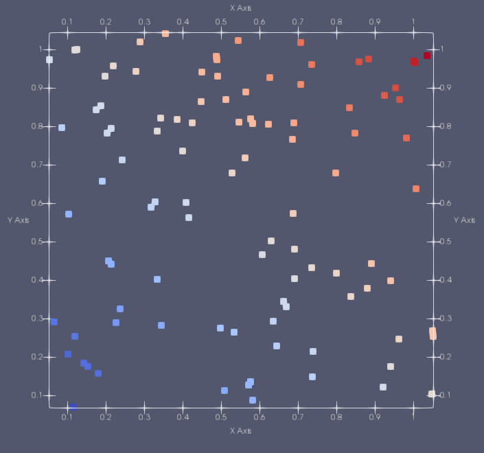

## Examples of distributed vector usage

### Vector 0: Simple vector initialization
This example show several basic functionalities of the distributed vector `vector_dist`. 
The distributed vector is a set of particles in an N-dimensional space.
In this example it is shown how to:

- Initialize the library
- Create a `Box` that defines the domain
- An array that defines the boundary conditions
- A `Ghost` object that will define the extension of the ghost part in physical units

 _The source code of the example [Vector/0_simple/main.cpp](https://github.com/mosaic-group/openfpm/blob/master/example/Vector/0_simple/main.cpp). The full doxygen documentation [Vector_0_simple](https://ppmcore.mpi-cbg.de/doxygen/openfpm/Vector_0_simple.html)_.

See also our video lectures dedicated to this topic [Video 1](https://ppmcore.mpi-cbg.de/upload/video/Lesson1-1.mp4), [Video 2](https://ppmcore.mpi-cbg.de/upload/video/Lesson1-2.mp4)

---

### Example 1: Vector Ghost layer

This example shows the properties of `ghost_get` and `ghost_put` - functions 
that synchronize the ghosts layer for a distributed vector `vector_dist`.

In this example it is shown how to:

- Iterate `vector_dist` via `getDomainIterator` 
- Redistribute the particles in `vector_dist` according to the underlying domain decomposition via `map`
- Synchronize the ghost layers in the standard way
- `NO_POSITION`, `KEEP_PROPERTIES` and `SKIP_LABELLING` options of the `ghost_get` function
- Propagate the data from ghost to non-ghost particles via `ghost_put`

 _The source code of the example [Vector/1_ghost_get_put/main.cpp](https://github.com/mosaic-group/openfpm/blob/master/example/Vector/1_ghost_get_put/main.cpp). The full doxygen documentation [Vector_1_ghost_get](https://ppmcore.mpi-cbg.de/doxygen/openfpm/Vector_1_ghost_get.html)_.

---

### Example 2: Cell-lists and Verlet-lists

This example shows the properties of `ghost_get` and `ghost_put` - functions 
that synchronize the ghosts layer for a distributed vector `vector_dist`.

Key points:

- How to utilize the grid iterator `getGridIterator`, to create a grid-like particle domain
- Two principal types of fast neighbor lists: cell-list `getCellList` and Verlet-list `getVerlet` for a distributed vector `vector_dist`
- `CELL_MEMFAST`, `CELL_MEMBAL` and `CELL_MEMMW` variations of the cell-list, with different memory requirements and computations costs
- Iterating through the neighboring particles via `getNNIterator` of cell-list and Verlet-list

 _The source code of the example [Vector/1_celllist/main.cpp](https://github.com/mosaic-group/openfpm/blob/master/example/Vector/1_ghost_get_put/main.cpp). The full doxygen documentation [Vector_1_celllist](https://ppmcore.mpi-cbg.de/doxygen/openfpm/Vector_1_celllist.html)_.

---

### Example 3: GPU vector

This example shows how to create a vector data-structure with `vector_dist_gpu` to access a `vector_dist`-alike data structure from GPU accelerated computing code.

Key points:

- How to convert the source code from using `vector_dist` to `vector_dist_gpu` and how it influences the memory layout of the data structure
- Oflloading particle position `hostToDevicePos` and particle property `hostToDeviceProp` data from CPU to GPU
- Lanuching a CUDA-like kernel with `CUDA_LAUNCH` and automatic subdivision of a computation loop into workgroups/threads via `getDomainIteratorGPU` or manually specifying the number of workgroups and the number of threads in a workgroup
- Passing the data-structures to a CUDA-like kernel code via `toKernel`
- How to use `map` with the option `RUN_DEVICE` to redistribute the particles directly on GPU, and `ghost_get` with `RUN_DEVICE` option to fill ghost particles directly on GPU
- How to detect and utilize RDMA on GPU to get the support of CUDA-aware MPI implementation to work directly with device pointers in communication subroutines

 _The source code of the example [Vector/1_gpu_first_step/main.cpp](https://github.com/mosaic-group/openfpm/blob/master/example/Vector/1_gpu_first_step/main.cpp). The full doxygen documentation [Vector_1_gpu_first_step](https://ppmcore.mpi-cbg.de/doxygen/openfpm/Vector_1_gpu_first_step.html)_.

---

### Example 4: HDF5 Save and load

This example show how to save and load a vector to/from the parallel file format HDF5.

Key points:

- How to save the position/property information of the particles `vector_dist` into an _.hdf5_ file via `save`
- How to load the position/property information of the particles `vector_dist` from an _.hdf5_ file via `load`

 _The source code of the example [Vector/1_HDF5_save_load/main.cpp](https://github.com/mosaic-group/openfpm/tree/master/example/Vector/1_HDF5_save_load/main.cpp). The full doxygen documentation [Vector_1_HDF5](https://ppmcore.mpi-cbg.de/doxygen/openfpm/Vector_1_HDF5.html)_.

---

### Example 5: Vector expressions

This example shows how to use vector expressions to apply mathematical operations and functions on particles. 
The example also shows to create a point-wise applicable function   
$$ A_q e^{\frac{|x_p-x_q|^2}{\sigma}} $$

where
$A_q$ is the property $A$ of particle $q$, $x_p, x_q$ are positions of particles $p, q$ correspondingly.

Key points:

- Setting an alias for particle properties via `getV` of `particle_dist` to be used within an expression 
- Composing expressions with scalar particle properties 
- Composing expressions with vector particle properties. The expressions are 1) applied point-wise; 2) used to create a component-wise multiplication via `*`; 3) scalar product via `pmul`; 4) compute a norm `norm`; 5) perform square root operation `sqrt`
- Converting `Point` object into an expression `getVExpr` to be used with vector expressions
- Utilizing ` operator=` and the function `assign` to assing singular or multiple particle properties per iteration through particles
- Constructing expressions with `applyKernel_in` and `applyKernel_in_gen` to create kernel functions called at particle locations 
for all the neighboring particles, e.g. as in SPH

$$\sum_{q = Neighborhood(p)}  A_q D^{\beta}ker(x_p,x_q) V_q $$

 _The source code of the example [Vector/2_expressions/main.cpp](https://github.com/mosaic-group/openfpm/tree/master/example/Vector/2_expressions/main.cpp). The full doxygen documentation [Vector_2_expression](https://ppmcore.mpi-cbg.de/doxygen/openfpm/Vector_2_expression.html)_.

---

### Example 6: Molecular Dynamics with Lennard-Jones potential (Cell-List)

This example shows a simple Lennard-Jones molecular dynamics simulation in a stable regime. 
The particles interact with the interaction potential   
$$ V(x_p,x_q) = 4( (\frac{\sigma}{r})^{12} - (\frac{\sigma}{r})^6  ) $$

$A_q$ is the property $A$ of particle $q$, $x_p, x_q$ are positions of particles $p, q$ correspondingly, $\sigma$ is a free parameter, $r$ is the distance between the particles.

Key points:

- Reusing memory allocated with `getCellList` for the subsequent iterations via `updateCellList`
- Utilizing `CELL_MEMBAL` with `getCellList` to minimize memory footprint
- Performing 10000 time steps using symplectic Verlet integrator

$$ \vec{v}(t_{n}+1/2) = \vec{v}_p(t_n) + \frac{1}{2} \delta t \vec{a}(t_n) $$

$$ \vec{x}(t_{n}+1) = \vec{x}_p(t_n) + \delta t \vec{v}(t_n+1/2) $$

$$ \vec{v}(t_{n+1}) = \vec{v}_p(t_n+1/2) + \frac{1}{2} \delta t \vec{a}(t_n+1) $$

- Producing a time-total energy 2D plot with `GoogleChart`

 _The source code of the example [Vector/3_molecular_dynamic/main.cpp](https://github.com/mosaic-group/openfpm/blob/master/example/Vector/3_molecular_dynamic/main.cpp). The full doxygen documentation [Vector_3_md_dyn](https://ppmcore.mpi-cbg.de/doxygen/openfpm/Vector_3_md_dyn.html)_.

---

### Example 7: Molecular Dynamics with Lennard-Jones potential (Verlet-List) [1/3]

The physical model in the example is identical to [Molecular Dynamics with Lennard-Jones potential (Cell-List)](#ex6). Please refer to it for futher details.
Key points:

- Due to the computational cost of updating Verlet-list, _r_cut + skin_ cutoff distance is used
such that the Verlet-list has to be updated once in 10 iterations via `updateVerlet`
- As Verlet-lists are constructed based on local particle id's, which would be invalidated by `map` or `ghost_get` ,`map` is called every 10 time-step, and `ghost_get` is used with `SKIP_LABELLING` option to keep old indices every iteration

 _The source code of the example [Vector/3_molecular_dynamic/main_vl.cpp](https://github.com/mosaic-group/openfpm/blob/master/example/Vector/3_molecular_dynamic/main_vl.cpp). The full doxygen documentation [Vector_3_md_vl](https://ppmcore.mpi-cbg.de/doxygen/openfpm/Vector_3_md_vl.html)_.

---

### Example 7: Molecular Dynamics with Lennard-Jones potential (Symmetric Verlet-List) [2/3]

This example is an extension to [Molecular Dynamics with Lennard-Jones potential (Verlet-List)](#ex7a). It shows how better performance can be achieved for symmetric interaction models with symmetric Verlet-list compared to the standard Verlet-list.
Key points:

- Computing the interaction for particles _p_, _q_ only once
- Propagate the data from potentially ghost particles _q_ to non-ghost particles in their corresponding domains via `ghost_put` with the operation `add_`
- Changing the prefactor in the subroutine of calculating the total energy as every pair of particles is visited once (as compared to two times before) 
- Updating Verlet-list once in 10 iterations via `updateVerlet` with 'VL_SYMMETRIC' flag

 _The source code of the example [Vector/5_molecular_dynamic_sym/main.cpp](https://github.com/mosaic-group/openfpm/blob/master/example/Vector/5_molecular_dynamic_sym/main.cpp). The full doxygen documentation [Vector_5_md_vl_sym](https://ppmcore.mpi-cbg.de/doxygen/openfpm/Vector_5_md_vl_sym.html)_.

---

### Example 7: Molecular Dynamics with Lennard-Jones potential (Symmetric CRS Verlet-List) [3/3]

This example is an extension to [Molecular Dynamics with Lennard-Jones potential (Verlet-List)](#ex7a) and [Molecular Dynamics with Lennard-Jones potential (Verlet-List)](#ex7b). It shows how better performance can be achieved for symmetric interaction models with symmetric Verlet-list compared to the standard Verlet-list.
Key points:

- Computing the interaction for particles _p_, _q_ only once
- Propagate the data from potentially ghost particles _q_ to non-ghost particles in their corresponding domains via `ghost_put` with the operation `add_`
- Changing the prefactor in the subroutine of calculating the total energy as every pair of particles is visited once (as compared to two times before) 
- Updating Verlet-list once in 10 iterations via `updateVerlet` with 'VL_SYMMETRIC' flag

 _The source code of the example [Vector/5_molecular_dynamic_sym/main.cpp](https://github.com/mosaic-group/openfpm/blob/master/example/Vector/5_molecular_dynamic_sym/main.cpp). The full doxygen documentation [Vector_5_md_vl_sym](https://ppmcore.mpi-cbg.de/doxygen/openfpm/Vector_5_md_vl_sym.html)_.

---

### Example 8: Molecular Dynamics with Lennard-Jones potential (GPU)

The physical model in the example is identical to [Molecular Dynamics with Lennard-Jones potential (Cell-List)](#ex6) and [Molecular Dynamics with Lennard-Jones potential (Verlet-List)](#ex7a). Please refer to those for futher details.
Key points:

- To get the particle index inside a CUDA-like kernel `GET_PARTICLE` macro is used to avoid overflow in the construction `blockIdx.x * blockDim.x + threadIdx.x`
- A primitive reduction function `reduce_local` with the operation `_add_` is used to get the total energy by summing energies of all particles.

 _The source code of the example [Vector/3_molecular_dynamic_gpu/main_vl.cpp](https://github.com/mosaic-group/openfpm/blob/master/example/Vector/3_molecular_dynamic_gpu/main.cu). The full doxygen documentation [Vector_3_md_dyn_gpu](https://ppmcore.mpi-cbg.de/doxygen/openfpm/Vector_3_md_dyn_gpu.html)_.

---

### Example 9: Molecular Dynamics with Lennard-Jones potential (GPU optimized)

The physical model in the example is identical to [Molecular Dynamics with Lennard-Jones potential (Cell-List)](#ex6), [Molecular Dynamics with Lennard-Jones potential (Verlet-List)](#ex7a) and is based on [Molecular Dynamics with Lennard-Jones potential (GPU)](#ex8). Please refer to those for futher details.
Key points:

- To achieve coalesced memory access on GPU and to reduce cache load the particle indices are stored in cell-list in a sorted manner, i.e. particles with neighboring indices are located in the same cell. This is achieved by assigning new particle indices and storing them temporarily in `vector_dist` by passing the parameter `CL_GPU_REORDER` to the method `getCellListGPU` of `vector_dist`. By default the method copies particle positions and no properties to the reordered vector. To copy properties as well they are passed as a template parameter `<...>` of the method `getCellListGPU`.
- The cell-list built on top of the reordered version of `vector_dist` uses `get_sort` instead of `get` to get a neighbor particle index when iterating with the cell-list neighborhood iterator `getNNIteratorBox`
- The sorted version of `vector_dist` have to be reordered to the original order once the processing is done via `restoreOrder` of `vector_dist`. By default the method copies particle positions and no properties to the original unordered vector. To copy properties as well they are passed as a template parameter `<...>` of the method `restoreOrder`.

 _The source code of the example [Vector/3_molecular_dynamic_gpu_opt/main_vl.cpp](https://github.com/mosaic-group/openfpm/blob/master/example/Vector/3_molecular_dynamic_gpu_opt/main_gpu.cu). The full doxygen documentation [Vector_3_md_dyn_gpu_opt](https://ppmcore.mpi-cbg.de/doxygen/openfpm/Vector_3_md_dyn_gpu_opt.html)_.

---

### Example 10: Molecular Dynamics with Lennard-Jones potential (Particle reordering)

The physical model in the example is identical to [Molecular Dynamics with Lennard-Jones potential (Cell-List)](#ex6), [Molecular Dynamics with Lennard-Jones potential (Verlet-List)](#ex7a). The example shows how reordering the data can significantly reduce the computational running time. 
Key points:

- The particles inside `vector_dist` are reordered via `reorder` following a Hilbert curve of order _m_ (here _m=5_) passing through the cells of $2^m \times 2^m \times 2^m$ (here, in 3D) cell-list
- It is shown that the frequency of reordering depends on the mobility of particles
- Wall clock time is measured of the function `calc_force` utilizing the object `timer` via `start` and `stop`

 _The source code of the example [Vector/4_reorder/main_data_ord.cpp](https://github.com/mosaic-group/openfpm/blob/master/example/Vector/4_reorder/main_data_ord.cpp). The full doxygen documentation [Vector_4_reo](https://ppmcore.mpi-cbg.de/doxygen/openfpm/Vector_4_reo.html)_.

---

### Example 11: Molecular Dynamics with Lennard-Jones potential (Cell-list reordering)

The physical model in the example is identical to [Molecular Dynamics with Lennard-Jones potential (Cell-List)](#ex6), [Molecular Dynamics with Lennard-Jones potential (Verlet-List)](#ex7a). The example shows how reordering the data can significantly reduce the computational running time. 
Key points:

- The cell-list cells are iterated following a Hilbert curve instead of a normal left-to-right bottom-to-top cell iteration (in 2D). The function `getCellList_hilb` of `vector_dist` is used instead of `getCellList`
- It is shown that for static or slowly moving particles a speedup of up to 10% could be achieved

 _The source code of the example [Vector/4_reorder/main_comp_ord.cpp](https://github.com/mosaic-group/openfpm/blob/master/example/Vector/4_reorder/main_comp_ord.cpp). The full doxygen documentation [Vector_4_comp_reo](https://ppmcore.mpi-cbg.de/doxygen/openfpm/Vector_4_comp_reo.html)_.

---

### Example 12: Complex properties [1/2]

This example shows how to use complex properties in the distributed vector `vector_dist`

Key points:

- Creating a distributed vector with particle properties: scalar, vector `float[3]`, `Point`, list of float `openfpm::vector<float>`, list of custom structures `openfpm::vector<A>` (where `A` is a user-defined type with no pointers), vector of vectors `openfpm::vector<openfpm::vector<float>>>`
- Redistribute the particles in `vector_dist` according to the underlying domain decomposition. Communicate only the selected particle properties via `map_list` (instead of communicating all `map`)
- Synchronize the ghost layers only for the selected particle properties `ghost_get`

 _The source code of the example [Vector/4_complex_prop/main.cpp](https://github.com/mosaic-group/openfpm/blob/master/example/Vector/4_complex_prop/main.cpp). The full doxygen documentation [Vector_4_complex_prop](https://ppmcore.mpi-cbg.de/doxygen/openfpm/Vector_4_complex_prop.html)_.

---

### Example 13: Complex properties [2/2]

This example shows how to use complex properties in the distributed vector `vector_dist`

Key points:

- Creating a distributed vector with particle properties: scalar, vector `float[3]`, `Point`, list of float `openfpm::vector<float>`, list of custom structures `openfpm::vector<A>` (where `A` is a user-defined type with memory pointers inside), vector of vectors `openfpm::vector<openfpm::vector<float>>>`
- Enabling the user-defined type being serializable by `vector_dist` via 
      - `packRequest` method to indicate how many byte are needed to serialize the structure
      - `pack` method to serialize the data-structure via methods `allocate`, `getPointer` of `ExtPreAlloc` and method `pack` of `Packer` 
      - `unpack` method to deserialize the data-structure via method `getPointerOffset` of `ExtPreAlloc` and method `unpack` of `Unpacker`
      - `noPointers` method to inform the serialization system that the object has pointers
      - Constructing constructor, destructor and `operator=` to avoid memory leaks 

 _The source code of the example [Vector/4_complex_prop/main.cpp](https://github.com/mosaic-group/openfpm/blob/master/example/Vector/4_complex_prop/main.cpp). The full doxygen documentation [Vector_4_complex_prop_ser](https://ppmcore.mpi-cbg.de/doxygen/openfpm/Vector_4_complex_prop_ser.html)_.

---

### Example 14: Multiphase Cell-lists and Verlet-lists

This example is an extension to [Example 2: Cell-lists and Verlet-lists](#ex2) and ()[]. It shows how to use multi-phase cell-lists and Verlet-list using multiple instances of `vector_dist`. Key points:

- All the phases have to use the same domain decomposition, which is achieved by passing the decomposition of the first phase to the constructor of `vector_dist` of all the other phases.
- The domains have to be iterated individually via `getDomainIterator`, the particles redistributed via `map`, the ghost layers synchronized via `ghost_get` for all the phases `vector_dist`.
- Constructing Verlet-lists for two phases (_ph0_, _ph1_) with `createVerlet`, where for one phase _ph0_ the neighoring particles of _ph1_ are assigned in the Verlet-list. Cell-list of _ph1_ has to be passed to `createVerlet`
- Constructing Verlet-lists for multiple phases (_ph0_, _ph1_, _ph2_...) with `createVerletM`, where for one phase _ph0_ the neighoring particles of _ph1_, _ph2_... are assigned in the Verlet-list. Cell-list containing all of _ph1_, _ph2_... create with `createCellListM` has to be passed to `createVerletM`
- Iterating over the neighboring particles of a multiphase Verlet-list with `getNNIterator` with `get` being substituded by `getP` (particle phase) and `getV` (particle id)
- Extending example of the symmetric interaction for multiphase cell-lists and Verlet-lists via `createCellListSymM`, `createVerletSymM`

 _The source code of the example [Vector/4_multiphase_celllist_verlet/main.cpp](https://github.com/mosaic-group/openfpm/blob/master/example/Vector/4_multiphase_celllist_verlet/main.cpp). The full doxygen documentation [Vector_4_mp_cl](https://ppmcore.mpi-cbg.de/doxygen/openfpm/Vector_4_mp_cl.html)_.

---

### Example 16: Validation and debugging

This example shows how the flexibility of the library can be used to perform complex tasks for validation and debugging.
Key points:

- To get unique global id's of the particles the function `accum` of `vector_dist` is used, which returns prefix sum of local domain sizes $j<i$ for the logical processor $i$ out of $N$ total processors
- Propagate the data from potentially ghost particles _q_ to non-ghost particles in their corresponding domains via `ghost_put` with the operation `merge_`, that merges two `openfpm::vector` (ghost and non-ghost)

 _The source code of the example [Vector/6_complex_usage/main.cpp](https://github.com/mosaic-group/openfpm/blob/master/example/Vector/6_complex_usage/main.cpp). The full doxygen documentation [Vector_6_complex_usage](https://ppmcore.mpi-cbg.de/doxygen/openfpm/Vector_6_complex_usage.html)_.

---

### Example 17: Smoothed Particle Hydrodynamics (SPH) formulation on CPU [1/2]

This example shows the classical SPH Dam break simulation with Load Balancing and Dynamic load balancing. The example has been adopted from [DualSPHysics](https://github.com/DualSPHysics/DualSPHysics/wiki/3.-SPH-formulation). Please refer to the website of [DualSPHysics](https://github.com/DualSPHysics/DualSPHysics/wiki/3.-SPH-formulation) and to the paper of [Monaghan, 1992](https://ui.adsabs.harvard.edu/abs/1992ARA&A..30..543M) for more details. 

####Formulation

The SPH formulation used in this example code follow these equations
$$ \frac{d\vec{v}_a}{dt} = - \sum_{b = NN(a) } m_b \left(\frac{P_a + P_b}{\rho_a \rho_b} + \Pi_{ab} \right) \nabla_{a} W_{ab} + g  $$
$$\frac{d\rho_a}{dt} =  \sum_{b = NN(a) } m_b vec{v}_{ab} \cdot \nabla_{a} W_{ab} $$
$$ P_a = b \left[ \left( \frac{\rho_a}{\rho_{0}} \right)^{\gamma} - 1 \right] $$

with the the viscosity term 

$$ \Pi_{ab} =  \begin{cases} - \frac{\alpha \bar{c_{ab}} \mu_{ab} }{\bar{\rho_{ab}} } & vec{v}_{ab} \cdot r_{ab} > 0 \\ 0 & vec{v}_{ab} \cdot r_{ab} < 0 \end{cases} $$

and the constants defined as

$$ b = \frac{c_{s}^{2} \rho_0}{\gamma} $$
$$ c_s = \sqrt{g \cdot h_{swl}} $$

The cubic kernel $W_{ab}$ defined as

$$ \begin{cases} 1.0 - \frac{3}{2} q^2 + \frac{3}{4} q^3 & 0 < q < 1 \\ (2 - q)^3 & 1 < q < 2 \\ 0 & q > 2 \end{cases} $$

its gradient $ \nabla W_{ab} $.

$$ \nabla W_{ab} = \beta (x,y,z) $$

$$ \beta = \begin{cases} (c_1 q + d_1 q^2) & 0 < q < 1 \\ c_2 (2 - q)^2 & 1 < q < 2 \end{cases} $$

While the particle kernel support is given by

$$ H = \sqrt{3 \cdot dp} $$

where $dp$ is the particle spacing. Please refer to the work of [Monaghan, 1992](https://ui.adsabs.harvard.edu/abs/1992ARA&A..30..543M) for more details on the variables and constants used.

The simulation uses an additional Tensile term to avoid the tensile instability. Please refer to [Monaghan, 1999](https://www.sciencedirect.com/science/article/pii/S0021999100964398) for more details on this scheme.

####Time-stepping
Dynamic time stepping is calculated in accordance with [Monaghan, 1992](https://ui.adsabs.harvard.edu/abs/1992ARA&A..30..543M)

$$ \delta t = CFL \cdot min(t_f,t_{cv}) $$

where

$$ \delta t_f = min \sqrt{h/\vec{f_a}} $$

$$ \delta t_{cv} = min \frac{h}{c_s + max \left| \frac{hv_{ab} \cdot r_{ab}}{r_{ab}^2} \right|} $$

With the governing equations are written as

$$ \frac{\vec{v}_a^{n+1}}{dt} = \vec{F_a} $$

$$ \frac{\rho_a^{n+1}}{dt} = D_a $$

$$ \frac{\vec{r}_a^{n+1}}{dt} = \vec{v}_a $$

The Verlet time-stepping scheme [Verlet, 1967](https://journals.aps.org/pr/abstract/10.1103/PhysRev.159.98) is used

$$ \vec{v}_a^{n+1} = \vec{v}_a^{n-1} + 2 \delta t \vec{F_a}^{n} $$

$$ \vec{r}_a^{n+1} = \delta t \vec{r}_a^n + \delta t \vec{v}_a^{n} + 0.5 \delta t^2 \vec{F_a}^n $$

$$ \rho_a^{n+1} = \rho_a^{n-1} + 2 \delta t D_a^n $$

Due to the integration over a staggered time interval, the equations of density and velocity are decoupled, which may lead to divergence of the integrated values. See [DualSPHysics](https://github.com/DualSPHysics/DualSPHysics/wiki/3.-SPH-formulation) formulation.

$$ \vec{v}_a^{n+1} = \vec{v}_a^{n} + \delta t \vec{F_a}^n $$

$$ \vec{r}_a^{n+1} = \vec{r}_a^{n} + \delta t \vec{v}_a^n + \frac{1}{2} \delta t^2 \vec{F_a}^n $$

$$ \rho_a^{n+1} = \rho_a^n + \delta t D_a^n $$

####Load Balancing

In order to reach an optimal utilization of available computational resource we distribute the particles to reach a balanced simulation. To do this we set weights for each sub-sub-domain, decompose the space and distribute the particles accordingly. 

The weights are set according to:

$$ w_v = 4 N_{fluid} + 3 N_{boundary} $$

where $N_{fluid}$ Is the number of fluid particles in a sub-sub-domain and $ N_{boundary} $ is the number of boundary particles.

Implicitly the communication cost is given by $ \frac{V_{ghost}}{V_{sub-sub}} t_s $, while the migration cost is given by $ v_{sub-sub} $. In general $ t_s $ is the number of `ghost_get` calls between two rebalance calls.

[Dynamic load balancing. Theory 1](https://openfpm.mpi-cbg.de/upload/video/dlb-1.mp4) 
[Dynamic load balancing. Theory 2](https://openfpm.mpi-cbg.de/upload/video/dlb-2.mp4) 
[Dynamic load balancing. Practice 1](https://openfpm.mpi-cbg.de/upload/video/dlb-3.mp4) 
[Dynamic load balancing. Practice 2](https://openfpm.mpi-cbg.de/upload/video/dlb-4.mp4) 

####Simulation results
[Simulation video 1](https://openfpm.mpi-cbg.de/web/images/examples/7_SPH_dlb/sph_speed.mp4) 
[Simulation video 2](https://openfpm.mpi-cbg.de/web/images/examples/7_SPH_dlb/sph_speed2.mp4) 
[Simulation dynamic load balancing video 1](https://openfpm.mpi-cbg.de/web/images/examples/7_SPH_dlb/sph_dlb.mp4) 
[Simulation dynamic load balancing video 2](https://openfpm.mpi-cbg.de/web/images/examples/7_SPH_dlb/sph_dlb2.mp4) 
[Simulation countour prospective 1](https://openfpm.mpi-cbg.de/web/images/examples/7_SPH_dlb/sph_zoom.mp4) 
[Simulation countour prospective 2](https://openfpm.mpi-cbg.de/web/images/examples/7_SPH_dlb/sph_back.mp4) 
[Simulation countour prospective 3](https://openfpm.mpi-cbg.de/web/images/examples/7_SPH_dlb/sph_all.mp4) 

Key points:

- Load balancing and dynamic load balancing indicate the possibility of the system to re-adapt the domain decomposition to keep all the processor under load and reduce idle time
- Cell-list is used to iterate neighboring particles when computing derivatives
- Domain decomposition could use a user-provided cost function on _sub-sub-domains_ later for them to be assigned to _sub-domains_ (usually equal to the number of processors) via `addComputationCosts` of `vector_dist`
- The object `DEC_GRAN(512)` passed to the constructor of `vector_dist` is related to the Load-Balancing decomposition granularity. It indicates that the space must be decomposed in at least $ N_{subsub} $ _sub-sub-domains_ for $ N_p $ processors

$$ N_{subsub} = 512 \cdot N_p $$ 

- Method `DrawBox` of the class `DrawParticles` returns an iterator that can be used to create particles on a Cartesian grid with a given spacing (grid boundaries should be inside the simulation domain).
- After filling the computational cost the domain stored in `vector_dist` is decomposed via `getDecomposition().decompose()` (i.e. every sub-sub-domain is assigned to a processor) and subsequently the particles are redistributed to the corresponding processors via `map`.

 _The source code of the example [Vector/7_SPH_dlb/main.cpp](https://github.com/mosaic-group/openfpm/blob/master/example/Vector/7_SPH_dlb/main.cpp). The full doxygen documentation [Vector_7_sph_dlb](https://ppmcore.mpi-cbg.de/doxygen/openfpm/Vector_7_sph_dlb.html)_.

---

### Example 17: Smoothed Particle Hydrodynamics (SPH) formulation on CPU: optimized [2/2]

The physical model in the example is identical to [Example 17: Smoothed Particle Hydrodynamics (SPH) formulation on CPU](#ex17a).

Key points:

- Verlet-list is used instead of Cell list to iterate neighboring particles when computing derivatives. The Verlet-list is reconstructed on maximum particle displacement reaching the half skin size. Symmetric interaction reduces the computation complexity by half. Ghost particles are used to store symmetric interaction force and density increments. The increments are added to the corresponding non-ghost particles via `ghost_put`
- `vector_dist` is constructed with the option `BIND_DEC_TO_GHOST`. It binds the domain decomposition to be multiple of the ghost size required by the symmetric interaction
- Refine the domain decomposition instead of decomposing the domain from scratch via `getDecomposition().redecompose(...)` of `vector_dist`. Available only for ParMetis decomposition.

 _The source code of the example [Vector/7_SPH_dlb_opt/main.cpp](https://github.com/mosaic-group/openfpm/blob/master/example/Vector/7_SPH_dlb/main.cpp). The full doxygen documentation [Vector_7_sph_dlb_opt](https://ppmcore.mpi-cbg.de/doxygen/openfpm/Vector_7_sph_dlb_opt.html)_.

---

### Example 18: Smoothed Particle Hydrodynamics (SPH) formulation on GPU [1/3]

The physical model in the example is identical to [Example 17: Smoothed Particle Hydrodynamics (SPH) formulation on CPU](#ex18a) with the computation-heavy subroutines being executed on GPU.

####Simulation results
[Simulation video 1](https://openfpm.mpi-cbg.de/web/images/examples/7_SPH_dlb/sph_gpu1.mp4) 
[Simulation video 2](https://openfpm.mpi-cbg.de/web/images/examples/7_SPH_dlb/sph_gpu2.mp4) 
[Simulation video 3](https://openfpm.mpi-cbg.de/web/images/examples/7_SPH_dlb/sph_gpu3.mp4) 

Key points:

- Derivative approximation scheme (SPH), particle force calculation, time integration schemes (Euler, Verlet time integration) and pressure sensor readings implemented on GPU.
- A primitive reduction function `reduce_local` with the operation `_add_` is used to get the total energy by summing energies of all particles.
- Particles exceeding the domain boundaries are removed with the GPU subroutine `remove_marked<prp>`, where `prp` is the property of `vector_dist` set to 1 for particles to be removed, and to 0 otherwise.

 _The source code of the example [Vector/7_SPH_dlb_gpu/main.cu](https://github.com/mosaic-group/openfpm/blob/master/example/Vector/7_SPH_dlb_gpu/main.cu). The full doxygen documentation [Vector_7_sph_dlb_gpu](https://ppmcore.mpi-cbg.de/doxygen/openfpm/Vector_7_sph_dlb_gpu.html)_.

---

### Example 18: Smoothed Particle Hydrodynamics (SPH) formulation on GPU: optimized [2/3]

The physical model in the example is identical to [Example 18: Smoothed Particle Hydrodynamics (SPH) formulation on GPU](#ex18a) with the computation-heavy subroutines being executed on GPU optimized for improved coalesced memory access.

Key points:

- To achieve coalesced memory access on GPU and to reduce cache load the particle indices are stored in cell-list in a sorted manner, i.e. particles with neighboring indices are located in the same cell. This is achieved by assigning new particle indices and storing them temporarily in `vector_dist` by passing the parameter `CL_GPU_REORDER` to the method `getCellListGPU` of `vector_dist`. By default the method copies particle positions and no properties to the reordered vector. To copy properties as well they are passed as a template parameter `<...>` of the method `getCellListGPU`.
- The cell-list built on top of the reordered version of `vector_dist` uses `get_sort` instead of `get` to get a neighbor particle index when iterating with the cell-list neighborhood iterator `getNNIteratorBox`
- The sorted version of `vector_dist` have to be reordered to the original order once the processing is done via `restoreOrder` of `vector_dist`. By default the method copies particle positions and no properties to the original unordered vector. To copy properties as well they are passed as a template parameter `<...>` of the method `restoreOrder`.

 _The source code of the example [Vector/7_SPH_dlb_gpu_opt/main.cu](https://github.com/mosaic-group/openfpm/blob/master/example/Vector/7_SPH_dlb_gpu_opt/main.cu). The full doxygen documentation [Vector_7_sph_dlb_gpu_opt](https://ppmcore.mpi-cbg.de/doxygen/openfpm/Vector_7_sph_dlb_gpu_opt.html)_.

---

### Example 18: Smoothed Particle Hydrodynamics (SPH) formulation on GPU: opetimized [3/3]

The physical model in the example is identical to [Example 18: Smoothed Particle Hydrodynamics (SPH) formulation on GPU: optimized](#ex18b) with the computation-heavy subroutines being executed on GPU optimized for improved coalesced memory access and particle force calculation performed in 2 steps. 

Key points:

- The subroutine `get_indexes_by_type` is used to split the particles into 2 lists of fluid and boundary particle ids. Two sets of GPU kernels are devised to calculate forces and density change separately for these two types of particles. 

 _The source code of the example [Vector/7_SPH_dlb_gpu_more_opt/main.cu](https://github.com/mosaic-group/openfpm/blob/master/example/Vector/7_SPH_dlb_gpu_more_opt/main.cu). The full doxygen documentation [Vector_7_sph_dlb_gpu_opt](https://ppmcore.mpi-cbg.de/doxygen/openfpm/Vector_7_sph_dlb_gpu_more_opt.html)_.

---

### Example 19: Discrete Element Method (DEM) simulation of the avalanche down the inclined plane

This example implements a Discrete Element Method (DEM) simulation using the Lorentz-force contact model.

A classical model for DEM simulations of spherical granular flows is the Silbert model,
it includes a Herzian contact force and an elastic deformation of the grains. Each particles
has a radius $R$, mass $m$, polar momentum $I$ and is represented by the location of its center of mass $r_{i}$.

When two particles $i$ and $j$ collide or are in contact, the elastic contact deformation is given by:

$$\delta_{ij} = 2R-r_{ij}$$

where $\vec{r_{ij}}$ is the distance vector connecting particle centers and $r_{ij} = {\lvert \vec{r}_{ij}\rvert}_2$ its module.
The normal and tangential components of the relative velocity at the point of contact is given by

$$\vec{v}_{n_{ij}} = \left(\vec{v}_{ij}\cdot\vec{n}_{ij}\right)\vec{n}_{ij}$$
$$\vec{v}_{t_{ij}} = \vec{v}_{ij}-\vec{v}_{n_{ij}}-R\left(\vec{\omega}_i + \vec{\omega}_j \right)\times \vec{n}_{ij} $$

with $\vec{n_{ij}}=\vec{r_{ij}}/r_{ij}$ is the normal unit vector in direction of the distance vector,
$\vec{\omega_i}$ is the angular velocity of a particle and $\vec{v_{ij}}=\vec{v_i}-\vec{v_j}$ the relative velocity between the two
particles. The evolution of the elastic tangential displacement $\vec{u_{t_{ij}}}$ is integrated when two particles are in contact using:

$$\vec{u'}_{t_{ij}} = \vec{u}_{t_{ij}} + \vec{v}_{t_{ij}} \delta t$$

Where $\delta t$ is the time step size. The deformation of the contacts points is stored for each particle and for each new contact
 point the elastic tangential displacement is initialized with $\vec{u_{t_{ij}}} = 0$. Thus for each pair of particle interacting
the normal and tangential forces become:

$$\vec{F}_{n_{ij}}=\sqrt{\frac{\delta_{ij}}{2R}}\,\,\left(k_n\delta_{ij}\vec{n}_{ij}-\gamma_n
m_{\text{eff}}\vec{v}_{n_{ij}}\right) \, ,$$
$$\vec{F}_{t_{ij}}=\sqrt{\frac{\delta_{ij}}{2R}}\,\,\left(-k_t\vec{u}_{t_{ij}}-\gamma_t
m_{\text{eff}}\vec{v}_{t_{ij}}\right) \, ,$$

where $k_{n,t}$ are the elastic constants in normal and tangential direction,
respectively, and $\gamma_{n,t}$ the corresponding viscoelastic constants. The
effective collision mass is given by $m_{\text{eff}}=\frac{m}{2}$. For each
contact point in order to enforce Coulomb's law 

$$\|\vec{F}_{t_{ij}}\|_2 < \|\mu\vec{F}_{n_{ij}}\|_2$$

the tangential force is bounded by the normal component force. In particular the elastic tangential displacement $\vec{u_{t_{ij}}}$ is
adjusted with

$$\vec{F}_{t_{ij}} \leftarrow \vec{F}_{t_{ij}}\frac{\|\mu\vec{F}_{n_{ij}}\|_2}{\|\vec{F}_{t_{ij}}\|_2}$$

This adjustment induce a truncation of the elastic displacement. The Coulomb condition
is equivalent to the case where two spheres slip against each other without
inducing additional deformations. Thus the deformation is truncated using:

$$\vec{u}_{t_{ij}} =
-\frac{1}{k_t}\left(\vec{F}_{t_{ij}} \sqrt{\frac{2R}{\delta_{ij}}} + \gamma_t
m_{\text{eff}}\vec{v}_{t_{ij}}\right) \, .$$

Considering that each particle $i$ interact with all the particles $j$ is in touch with , the total resultant force on particle $i$ is then computed by summing the contributions of all pair particles $(i,j)$. Considering that the grains are also under the effect of the gravitational field we obtain that the total force is given by

$$\vec{F}_i^{\text{tot}}=m \vec{g} + \sum_j\left(\vec{F}_{n_{ij}}+\vec{F}_{t_{ij}}\right) \, ,$$

where $\vec{g}$ is the acceleration due to gravity.
Because particles has also rotational degree of freedoms, the total torque on particle $i$ is calculated using

$$\vec{T}_i^{\text{tot}} = -R \sum_j \vec{n}_{ij}\times\vec{F}_{t_{ij}} \, .$$

$\vec{r}_i$ and angular velocities $\vec{\omega}_i$ for each particle $i$ at time step $n+1$,
We integrate in time the equations using leap-frog scheme with time step given by 

$$\delta t = 10^{-6}\,$$
$$\vec{v}_i^{n+1} = \vec{v}_i^n + \frac{\delta t}{m}\vec{F}_i^{\text{tot}} \, , \qquad \vec{r}_i^{n+1} = \vec{r}_i^n + \delta t \vec{v}_i^{n+1}$$
$$\vec{\omega}_i^{n+1} = \vec{\omega}_i^n + \frac{\delta t}{I_i}\vec{T}_i^{\text{tot}} \, ,$$

where $\vec{r}_i^{n},\vec{v}_i^{n},\vec{\omega}_i^{n}$ denotes respectively
the position, the speed and the rotational speed of the particle $i$ at time step
$n$, and $\delta t$ the time step size.

####Simulation results
[Simulation video 1](https://openfpm.mpi-cbg.de/web/images/examples/8_DEM/DEM_velocity.mp4) 

Key points:

- Method `DrawBox` of the class `DrawParticles` returns an iterator that can be used to create particles on a Cartesian grid with a given spacing (grid boundaries should be inside the simulation domain).
- Domain decomposition uses a quadratic cost function assigned to _sub-domains_ as a function of the number of _sub-sub-domains_ via `addComputationCosts` of `vector_dist`
- Refine the domain decomposition instead of decomposing the domain from scratch via `getDecomposition().redecompose(...)` of `vector_dist`. Available only for ParMetis decomposition.
- Iterating through the neighboring particles via `getNNIterator` of Verlet-list.
- The method `updateVerlet` of `vector_dist` is used to update an existing Verlet-list after particles have changed their positions.

 _The source code of the example [Vector/8_DEM/main.cpp](https://github.com/mosaic-group/openfpm/blob/master/example/Vector/8_DEM/main.cpp). The full doxygen documentation [Vector_8_DEM](https://ppmcore.mpi-cbg.de/doxygen/openfpm/Vector_8_DEM.html)_.

---

### Example 20: GPU CUDA interoperability

This example shows how to access and operate data arrays in GPU kernels via memory pointers obtained from distributed data-structures.

Key points:

- The concept of coalesced memory access is shown for scalar property, vector and tensor properties.
- Memory reallocation process and the concept of memory alignment is explained when extending a vector. 
- The method `getDeviceBuffer<...>()` of a serial property vector `vector` returned by `getPropVector` of parallel vector `vector_dist` is used to obtain an internal device pointer for the given property.

 _The source code of the example [Vector/9_gpu_cuda_interop/main.cu](https://github.com/mosaic-group/openfpm/blob/master/example/Vector/9_gpu_cuda_interop/main.cu). The full doxygen documentation [9_gpu_cuda_interop](https://ppmcore.mpi-cbg.de/doxygen/openfpm/Vector_9_gpu_cuda_interop.html)_.

---

